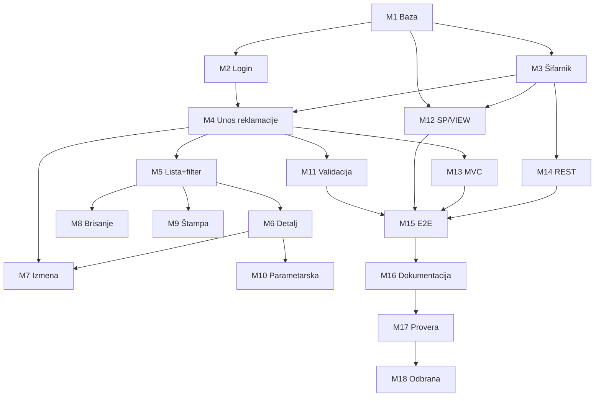

# PLAN IMPLEMENTACIJE — Status implementacije

**Projekat:** Evidentiranje reklamacija društvenih igara
**Referenca:** [SPECIFIKACIJA_PROJEKTA.md](SPECIFIKACIJA_PROJEKTA.md), [ZAHTEVI.md](ZAHTEVI.md), [PLAN_ADAPTACIJE.md](PLAN_ADAPTACIJE.md)

---

## Legenda statusa

| Oznaka | Značenje |
|--------|----------|
| ✅ | Završeno i provereno |
| ⏳ | U toku / sledeća faza |
| — | Nije započeto |

---

## Milestone 1 — Baza podataka i domen

| Stavka | Status |
|--------|--------|
| 5 tabela: korisnik, kategorija_igre, drustvena_igra, reklamacija, stavka_reklamacije | ✅ |
| FK relacije celina–deo–šifarnik | ✅ |
| UNIQUE BrojReklamacije | ✅ |
| Kolone BrojReklamacije, ReklamacijuEvidentirao, RazlogReklamacije, DatumEvidentiranja, Napomena NOT NULL | ✅ |
| Baza: reklamacije_drustvenih_igara_vp_2026 | ✅ |

---

## Milestone 2 — Login

| Stavka | Status |
|--------|--------|
| Prijava korisnika i sesija | ✅ |
| Zaštita poslovnih stranica | ✅ |
| Odjava | ✅ |

---

## Milestone 3 — Šifarnik društvenih igara

| Stavka | Status |
|--------|--------|
| CRUD društvenih igara | ✅ |
| Kategorija igara — šifarnik za izbor (bez posebnog CRUD-a) | ✅ |
| Unos igre preko stored procedure | ✅ |
| Pregled kataloga preko VIEW-ova | ✅ |
| Upload slike igre | ✅ |

---

## Milestone 4 — Unos reklamacije (master-detail)

| Stavka | Status |
|--------|--------|
| Forma master + stavke na jednoj stranici | ✅ |
| Transakcioni unos (reklamacija + stavke) | ✅ |
| RazlogReklamacije na stavkama | ✅ |
| Napomena obavezna; Datum evidentiranja readonly na formi | ✅ |
| Validacije unosa | ✅ |

---

## Milestone 5 — Lista i filter

| Stavka | Status |
|--------|--------|
| Tabelarni prikaz reklamacija | ✅ |
| Filter po broju, datumu, dobavljaču | ✅ |
| Prikaz stavki u listi | ✅ |

---

## Milestone 6 — Detaljni prikaz

| Stavka | Status |
|--------|--------|
| Pojedinačni prikaz zapisnika | ✅ |
| Datum evidentiranja i Reklamaciju evidentirao | ✅ |
| Sve stavke sa Razlog reklamacije | ✅ |
| Rekapitulacija | ✅ |

---

## Milestone 7 — Izmena reklamacije

| Stavka | Status |
|--------|--------|
| Izmena master podataka (DatumEvidentiranja se ne menja) | ✅ |
| Izmena postojećih stavki | ✅ |
| Dodavanje novih stavki | ✅ |
| Brisanje uklonjenih stavki | ✅ |
| Transakciona izmena | ✅ |

---

## Milestone 8 — Brisanje

| Stavka | Status |
|--------|--------|
| Brisanje reklamacije sa potvrdom | ✅ |
| CASCADE brisanje stavki | ✅ |

---

## Milestone 9 — Štampa svih / filtriranih

| Stavka | Status |
|--------|--------|
| Štampa svih reklamacija | ✅ |
| Štampa filtriranih reklamacija | ✅ |

---

## Milestone 10 — Parametarska štampa zapisnika

| Stavka | Status |
|--------|--------|
| Parametarska štampa jednog zapisnika | ✅ |
| Layout po prijavljenom dokumentu (01/02/03, evidentirao, datum evidentiranja) | ✅ |
| Bez „Odgovorno lice“ i generičkog datuma štampe | ✅ |

---

## Milestone 11 — Validacije

| Stavka | Status |
|--------|--------|
| Client-side validacije (HTML/JS) | ✅ |
| Server-side validacije (PHP) — reklamacije i katalog igara | ✅ |
| Jedinstvenost BrojReklamacije i SifraIgre | ✅ |
| RazlogReklamacije, Napomena, DatumEvidentiranja validacija | ✅ |

---

## Milestone 12 — Stored procedure i VIEW

| Stavka | Status |
|--------|--------|
| SP DodajDrustvenuIgru | ✅ |
| VIEW-ovi za katalog igara | ✅ |
| Korišćenje iz PHP aplikacije | ✅ |

---

## Milestone 13 — MVC

| Stavka | Status |
|--------|--------|
| Controller → Model → Repository → View | ✅ |
| READ tok kroz repository sloj | ✅ |
| WRITE tok kroz repository sloj | ✅ |

---

## Milestone 14 — REST servis

| Stavka | Status |
|--------|--------|
| REST ruter | ✅ |
| Endpointi za društvene igre | ✅ |

---

## Milestone 15 — End-to-end integracija

| Stavka | Status |
|--------|--------|
| Login → katalog → unos → lista → detalj → izmena → brisanje → štampa | ✅ |
| Runtime: prazna Napomena odbijena; DatumEvidentiranja nepromenjen pri edit-u | ✅ |

---

## Milestone 16 — Dokumentacija seminarskog rada

| Stavka | Status |
|--------|--------|
| Sekcije DOC-01–15 | ⏳ |
| Dijagrami, screenshoti, opis koda | ⏳ |

---

## Milestone 17 — Finalna provera usklađenosti

| Stavka | Status |
|--------|--------|
| Provera svih zahteva iz SPECIFIKACIJA_PROJEKTA | ⏳ |
| Ažuriranje ZAHTEVI statusa | ✅ |

---

## Milestone 18 — Priprema za odbranu

| Stavka | Status |
|--------|--------|
| Mock odbrana: SP, VIEW, REST, OOP, parametarska štampa | ⏳ |
| Predaja na GitHub i učionicu | ⏳ |

---

## Dependency graph

---

## Sledeći koraci

1. Kreirati seminarsku dokumentaciju (M16)
2. Finalna provera usklađenosti (M17)
3. Priprema i predaja za odbranu (M18)
